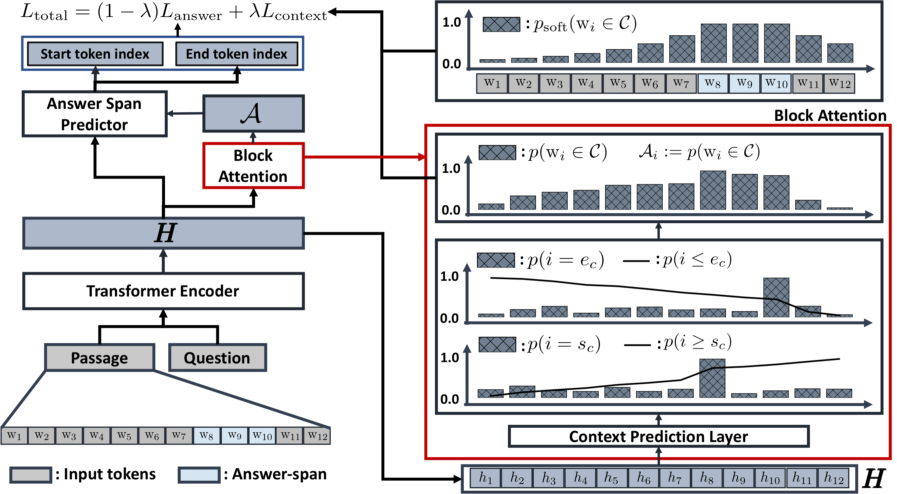

## Context-Aware Answer Extraction in Question Answering

**Yeon Seonwoo, Ji-Hoon Kim, Jung-Woo Ha, Alice Oh** | [Paper](https://www.aclweb.org/anthology/2020.emnlp-main.189/)

KAIST, NAVER CLOVA, NAVER AI LAB

## Abstract

Extractive QA models have shown very promising performance in predicting the correct answer to a question for a given passage. However, they sometimes result in predicting the correct answer text but in a context irrelevant to the given question. This discrepancy becomes especially important as the number of occurrences of the answer text in a passage increases. To resolve this issue, we propose BLANC (BLock AttentioN for Context prediction) based on two main ideas: context prediction as an auxiliary task in multi-task learning manner, and a block attention method that learns the context prediction task. With experiments on reading comprehension, we show that BLANC outperforms the state-of-the-art QA models, and the performance gap increases as the number of answer text occurrences increases. We also conduct an experiment of training the models using SQuAD and predicting the supporting facts on HotpotQA and show that BLANC outperforms all baseline models in this zero-shot setting.

## Overview of BLANC

<p align="center"></p>

## Getting Started
### Build train/dev/test set from NaturalQ-MRQA dataset

1. Download NaturalQ (MRQA) train/dev dataset ([link](https://github.com/mrqa/MRQA-Shared-Task-2019#datasets)) and locate the train/dev set in data/naturalQ/ directory

2. Rename the dev set to test.jsonl.gz

3. Run split_data.py in code/src/preprocessor as follows:

```bash
python split_data.py \
    --source ../../../data/naturalQ/train.jsonl.gz \
    --train_output train.jsonl \
    --dev_output dev.jsonl \
    --data_type mrqa
```

4. Compress train.jsonl and dev.jsonl with gzip (gzip train.jsonl; gzip dev.jsonl)

5. Locate these two files into data/naturalQ/ directory

6. Now you have train/dev/test set in data/naturalQ directory


### Train BLANC on NaturalQ

Run BLANC script in code/ as follows:

```bash
LABEL=trial_001 GEOP=0.99 WINS=3 LMB=0.8 bash run_blanc_naturalqa.sh
```

### Test BLANC

Indicate which checkpoint you want to test.

In this case, we test BLANC with trial_001 checkpoint.

```bash
LABEL=trial_001 GEOP=0.99 WINS=3 LMB=0.8 bash run_blanc_naturalqa_test.sh
```

## Code Reference

https://github.com/facebookresearch/SpanBERT

## Copyright

Copyright 2020-present NAVER Corp. and KAIST(Korea Advanced Institute of Science and Technology)

## Acknowledgement

This work was partly supported by NAVER Corp. and Institute for Information & communications Technology Promotion(IITP) grant funded by the Korea government(MSIP) (2017-0-01780, The technology development for event recognition/relational reasoning and learning knowledge based system for video understanding).

## How to cite

```
@inproceedings{seonwoo-etal-2020-context,
    title = "Context-Aware Answer Extraction in Question Answering",
    author = "Seonwoo, Yeon  and
      Kim, Ji-Hoon  and
      Ha, Jung-Woo  and
      Oh, Alice",
    booktitle = "EMNLP",
    year = "2020",
}
```
